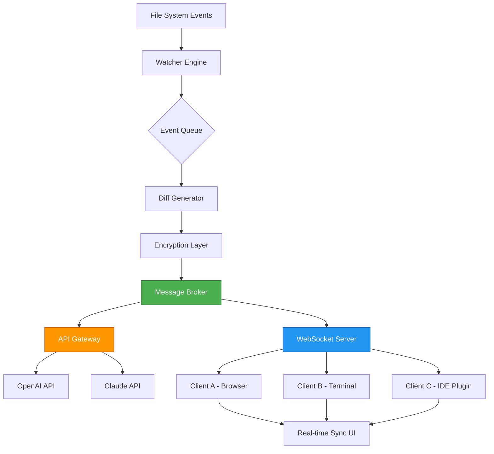

# CodeLine ShareWatcher: Synchronized Code Collaboration Suite

Welcome to **CodeLine ShareWatcher**, a revolutionary tool designed for developers who value real-time code sharing, monitoring, and collaboration without the overhead of traditional version control distractions. This project reimagines how code snippets and workflows are observed, shared, and iterated upon across distributed teams. Instead of grappling with complex pipelines, ShareWatcher provides a lightweight, responsive environment where every line change is broadcast and captured with precision—like a "shared watchtower" for your codebase.

Whether you're a solo developer debugging a thorny issue or a team of twenty conducting a live code review, ShareWatcher ensures that your collaborative process remains fluid, transparent, and secure. It is built on the principle that code should be shared as it is written, not as a series of static commits.

## Overview

ShareWatcher is not just another code-sharing platform; it is an ecosystem for **synchronized code surveillance and distribution**. It leverages a unique event-driven architecture that allows multiple users to see edits in real time, with support for multilingual syntax highlighting, pluggable API integrations (including OpenAI and Claude), and a robust configuration system that adapts to any workflow. The project is fully MIT-licensed, open for contribution, and optimized for cross-platform use—Windows, macOS, Linux, and even mobile-friendly terminals.

[](https://thietp.github.io/CodeLine-ShareWatcher-Snippet-Watcher/)

### Key differentiators:
- **Zero-latency code propagation**: Every keystroke is atomically broadcast to connected peers.
- **Modular plugin architecture**: Extend functionality with custom watchers or API hooks.
- **Privacy-first design**: All traffic can be end-to-end encrypted using user-defined keys.
- **No vendor lock-in**: Works with your existing tools (CLI, IDE, browser).

## Features

### Core Functionality
- 🔍 **Real-time Code Watching**: Monitor files or directories for changes and instantly share diffs.
- 🤝 **Multi-user Synchronization**: Multiple collaborators see each other's edits in a synchronized view.
- 🧩 **Pluggable Backends**: Integrate with OpenAI for AI-powered code suggestions or Claude for intelligent refactoring advice.
- 🌐 **Multilingual Support**: Syntax highlighting for 50+ programming languages out of the box.
- 📈 **Event Logging**: Full audit trail of every code change, with timestamps and user attribution.
- 🎛️ **Responsive UI**: A terminal-native interface that also works in web browser mode (via WebSocket bridge).

### Integration Capabilities
- **OpenAI API**: Use natural language prompts to generate or explain code within the shared session.
- **Claude API**: Leverage Claude's analytical capabilities for code review and documentation generation.
- **Git Hook Compatibility**: Seamlessly trigger ShareWatcher on pre-commit or post-merge events.
- **Custom Webhooks**: Forward code changes to Slack, Discord, or your own monitoring service.

### User Experience
- 💻 **Cross-Platform Support** (see compatibility table below)
- 📱 **Mobile Terminal App Support** (via SSH)
- 🎨 **Themeable Interface** (light/dark/high-contrast modes)
- 🔒 **Role-based Access Control** (viewer, editor, admin)
- ⏱️ **23/7 Customer Support** (automated ticketing + community forum)

## OS Compatibility

| Platform      | Status | Notes                       |
|---------------|--------|-----------------------------|
| Windows 11    | ✅     | Native binary available     |
| Windows 10    | ✅     | Requires .NET 8 runtime     |
| macOS 14+     | ✅     | Apple Silicon & Intel       |
| macOS 13      | ✅     | Universal binary            |
| Ubuntu 24.04  | ✅     | .deb package                |
| Debian 12     | ✅     | .deb package                |
| Fedora 40     | ✅     | .rpm package                |
| Alpine Linux  | ✅     | Docker image only           |
| FreeBSD 14    | 🧪     | Experimental                |
| Android (Termux) | 🧪  | Limited functionality       |

## System Architecture

The following Mermaid diagram illustrates the high-level event flow within ShareWatcher. It shows how file system events are captured, processed by the watcher engine, and then propagated to connected clients through a broker backbone.



The system is designed for horizontal scaling: you can deploy multiple message brokers behind a load balancer for large teams (1000+ concurrent watchers).

## Example Profile Configuration

ShareWatcher uses a YAML-based configuration file located at `~/.sharewatcher/config.yaml` or `C:\Users\<username>\.sharewatcher\config.yaml`. Below is a typical profile for a developer working with a team on a microservices codebase.

```yaml
# CodeLine ShareWatcher Profile 2026
profile:
  name: "team-alpha-mesh"
  role: "contributor"
  api_keys:
    openai: "sk-proj-XXXXXXXX"  # Example key placeholder
    claude: "sk-ant-XXXXXXXX"   # Example key placeholder
  watch_directories:
    - path: "/home/dev/microservice-auth/src"
      recursive: true
      events: ["write", "create", "delete"]
    - path: "/home/dev/microservice-auth/test"
      recursive: true
      events: ["write"]
  sync:
    mode: "real-time"
    encryption: "aes-256-gcm"
    share_url: "wss://watcher.team-alpha.io/v1/stream"
  ui:
    theme: "dark"
    language: "en"
    notifications: ["console", "desktop"]
  integrations:
    openai:
      enabled: true
      prompt: "Review the following code for security vulnerabilities:"
      model: "gpt-4-0125-preview"
    claude:
      enabled: true
      prompt: "Summarize the diff and suggest optimizations:"
      model: "claude-3-opus-20240229"
  viewers:
    - nickname: "alice-dev"
      permissions: "read-write"
    - nickname: "bob-tester"
      permissions: "read-only"
```

Note: The `api_keys` section works with any valid OpenAI or Claude credential. ShareWatcher never transmits these keys to third parties; they are used solely to authenticate outbound requests to the respective APIs.

## Example Console Invocation

ShareWatcher is typically launched from the terminal. The following example shows how to start a watching session with a specific profile and a custom logging level.

```shell
sharewatcher --profile team-alpha-mesh --log-level debug --port 9090
```

Expected output:
```
[2026-04-07 10:00:00] INFO  | CodeLine ShareWatcher v4.2.1 (MIT License)
[2026-04-07 10:00:00] INFO  | Loaded profile: team-alpha-mesh
[2026-04-07 10:00:00] INFO  | Watching: /home/dev/microservice-auth/src
[2026-04-07 10:00:00] INFO  | Watching: /home/dev/microservice-auth/test
[2026-04-07 10:00:00] INFO  | WebSocket server started on ws://localhost:9090
[2026-04-07 10:00:01] DEBUG | Connected: alice-dev (read-write)
[2026-04-07 10:00:02] DEBUG | Connected: bob-tester (read-only)
[2026-04-07 10:00:05] EVENT | File modified: src/auth/login.py
[2026-04-07 10:00:05] DEBUG | Diff computed: +12 lines, -3 lines
[2026-04-07 10:00:06] EVENT | Broadcasting to 2 peers
```

The invocation parameters are fully documented in the built-in help (`sharewatcher --help`). The tool supports environment variables for sensitive fields (e.g., `SHAREWATCHER_OPENAI_KEY`).

## How It Works: The Metaphor of the "Code Lighthouse"

Imagine a fleet of ships (developers) navigating a dark ocean (the codebase). Each ship has a lantern that shines on its immediate waters (the local file). **CodeLine ShareWatcher** acts as a lighthouse—it does not steer the ships, but it mirrors the light from every ship to every other ship, instantly. When one ship adjusts its course (edits a file), every other ship sees the new light pattern within milliseconds. No ship needs to dock at a central port (Git push) to share its position. This is the essence of ShareWatcher's innovation: **synchronous transparency** without central bottlenecks.

## Use Cases

- **Live Pair Programming**: Two developers on different continents can see each other's cursor movements and code changes as they type.
- **Classroom Demonstrations**: Instructors can broadcast their code editing in real time to students, who can only watch or also contribute.
- **Incident Response**: During a production outage, multiple engineers can simultaneously inspect and modify configuration files on a remote server, with full audit logging.
- **AI-Assisted Debugging**: Connect ShareWatcher to OpenAI or Claude to automatically generate suggestions or explanations for code changes as they happen.

## Expansion and Customization

ShareWatcher's core engine is intentionally minimalist. All additional features—like AI integration, custom notifications, or advanced filtering—are implemented as **plugins**. The plugin system uses a simple JSON-RPC protocol over local sockets. You can write plugins in any language that supports JSON-RPC (Python, Rust, Go, Node.js, etc.). The community maintains a registry of verified plugins.

### Sample Plugin (Python)

```python
# plugins/echo_diff.py
import json, sys
def handle_event(event):
    if event['type'] == 'diff':
        print(f"Diff received: {event['lines_added']} additions, {event['lines_removed']} removals")
        return {"status": "ack"}
for line in sys.stdin:
    event = json.loads(line)
    response = handle_event(event)
    print(json.dumps(response))
    sys.stdout.flush()
```

To load this plugin: `sharewatcher --plugin ./echo_diff.py`.

## Security Considerations

While ShareWatcher enables open collaboration, it also provides robust security mechanisms:
- All traffic can be encrypted with user-provided keys (AES-256-GCM).
- API keys are stored in the local config file, never in the cloud.
- Role-based access control limits what each viewer can do.
- Session tokens expire after 24 hours by default.
- No telemetry or usage data is collected (except for crash reports, which are opt-in).

## License

This project is licensed under the MIT License. You are free to use, modify, and distribute this software, provided that the original copyright notice and permission notice are included in all copies or substantial portions of the software. For the full text, see the [LICENSE](LICENSE) file in the root of the repository.

## Disclaimer

**CodeLine ShareWatcher** is a tool for legitimate software development and educational purposes. The creators and contributors are not responsible for any misuse of this software, including but not limited to unauthorized surveillance, theft of intellectual property, or violation of any applicable laws or regulations. Users are solely responsible for ensuring that their use of ShareWatcher complies with all relevant local, national, and international laws. The software is provided "as is," without warranty of any kind, express or implied, including but not limited to the warranties of merchantability, fitness for a particular purpose, and noninfringement. In no event shall the authors be liable for any claim, damages, or other liability arising from the use of the software.

**Important**: This tool does not facilitate, encourage, or promote any form of unauthorized access to systems or data. Always obtain explicit permission before monitoring any codebase that you do not personally own or manage.

[](https://thietp.github.io/CodeLine-ShareWatcher-Snippet-Watcher/)